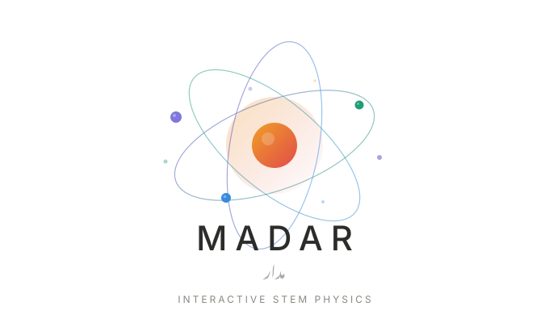
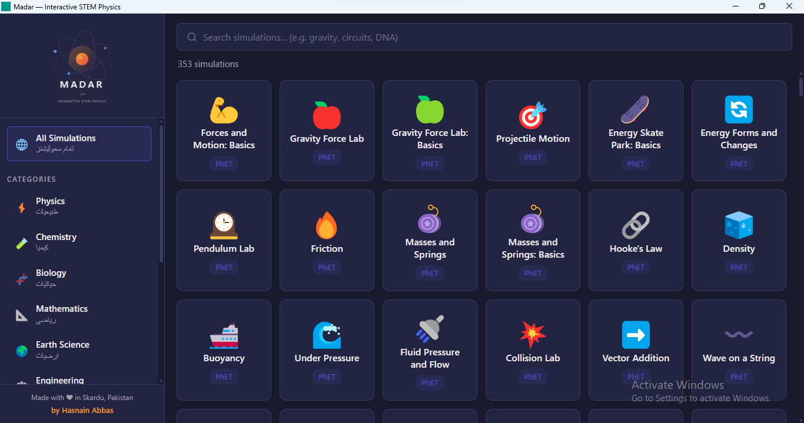
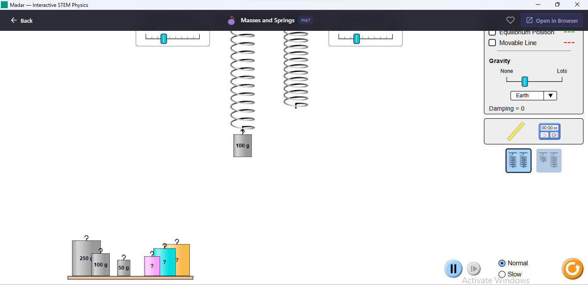
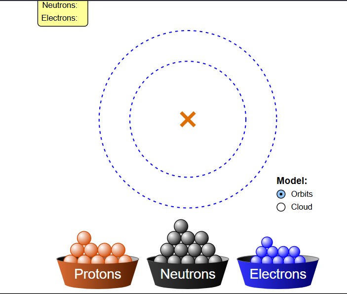
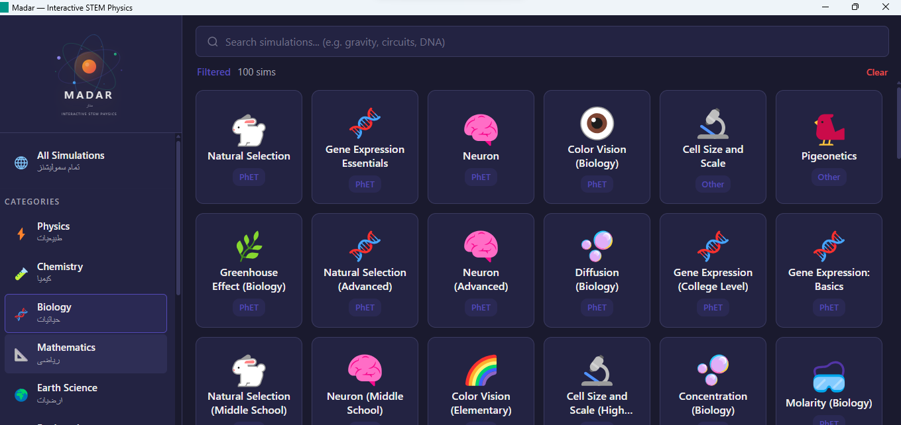

<div align="center">



<h1 align="center">Madar</h1>

**مدار — Interactive STEM Physics**

A fast, lightweight STEM simulation browser with **585 embedded simulations** across Physics, Chemistry, Biology, Mathematics, Earth Science & Engineering — all in one app. Built for students in Pakistan, on Android, desktop, and the web.

[](#license)
[](https://tauri.app)
[](https://svelte.dev)
[](#about)

[Web App](https://hasnain7abbas.github.io/Madar/) / [Android & Desktop](https://github.com/hasnain7abbas/Madar/releases) / [Source Code](https://github.com/hasnain7abbas/Madar)

</div>

## Screenshots





<div align="center">
<table>
<tr>
<td></td>
<td></td>
</tr>
<tr>
<td align="center"><em>Build an Atom — Chemistry</em></td>
<td align="center"><em>Browse Biology Simulations</em></td>
</tr>
</table>
</div>

## Features

- **585 interactive simulations** from PhET, Falstad, Chrome Music Lab, Nicky Case, myPhysicsLab, oPhysics, GeoGebra, Desmos, Concord Consortium, LabXchange & more
- **6 subject categories**: Biology (195), Chemistry (166), Physics (134), Math (57), Earth Science (19), Engineering (14)
- **Play simulations inside the app** — no need to open a browser
- **Search & filter** by category, source, grade level, or keywords
- **Favorites system** — save simulations you love
- **Android-optimized** — full-screen safe-area layout, touch-tuned controls, sideloadable `.apk`
- **Pakistan grade bands** — پرائمری / مڈل / میٹرک / انٹر, with FBISE/PCTB topic tags
- **Urdu support** — category labels, Urdu names for the most-used sims, and a PhET اردو language toggle
- **Fully responsive** — works on phone, tablet, and desktop
- **Offline desktop app** via Tauri v2 (Windows / Mac / Linux)
- **Web version** works on any device with a browser
- **Lightweight** — ~95 KB gzipped frontend, runs on low-end hardware
- **Dark & light themes** with the Madar orbital design language
- **Proprietary** — All rights reserved by Hasnain Abbas

## Who Is Madar For?

- **Students** (middle school to college) who want to *see* physics, chemistry, and biology instead of just reading equations
- **Teachers** who need a quick demo tool for classroom presentations
- **Curious minds** who want to explore science interactively

## Quick Start

### Option A: Use the Web App (No Install)

> **[https://hasnain7abbas.github.io/Madar/](https://hasnain7abbas.github.io/Madar/)**

Works on phones, tablets, and computers. Just open and start exploring.

### Option B: Android App

Download the latest `.apk` from [Releases](https://github.com/hasnain7abbas/Madar/releases), enable **"Install from unknown sources"**, and open it. Built for low-end Android phones.

### Option C: Desktop App

Download the latest installer (`.exe` / `.msi` / `.dmg` / `.deb`) from [Releases](https://github.com/hasnain7abbas/Madar/releases), or build from source:

```bash
git clone https://github.com/hasnain7abbas/Madar.git
cd Madar
npm install
npm run tauri dev
```

### Build the Installer

```bash
npm run tauri build            # desktop installer (.exe / .msi / .dmg / .deb)
npm run tauri android init     # one-time Android project scaffold
npm run tauri android build    # Android .apk / .aab
```

Find desktop installers at `src-tauri/target/release/bundle/` and Android packages at `src-tauri/gen/android/app/build/outputs/`.

> Installers and the Android APK are also built automatically on every `v*` tag by GitHub Actions (`.github/workflows/release.yml` + `android.yml`).

## Tech Stack

| Layer | Technology |
|-------|-----------|
| Frontend | Svelte 5, TypeScript, Vite |
| Desktop | Tauri v2 (Rust) — Windows / macOS / Linux |
| Mobile | Tauri v2 (Rust) — Android `.apk` |
| Hosting | GitHub Pages |
| CI/CD | GitHub Actions — Pages deploy, desktop release, Android APK |
| Simulations | PhET, Falstad, Chrome Music Lab, Nicky Case, myPhysicsLab, oPhysics, GeoGebra, Desmos, Concord, LabXchange |

## Simulation Sources

| Source | Count | Description |
|--------|-------|-------------|
| **PhET** | 376 | University of Colorado's interactive HTML5 simulations (CC BY) |
| **Other** | 86 | Stellarium Web, Ray Optics, Mathigon Polypad, MolView, 3Dmol.js & more |
| **Falstad** | 38 | Paul Falstad's HTML5 physics & math applets (GPL-2.0) |
| **oPhysics** | 17 | Clean interactive physics visualizations |
| **Concord** | 16 | Concord Consortium inline interactives (gas laws, diffusion, DNA→protein) |
| **Chrome Music Lab** | 13 | Google's interactive music/sound experiments (Apache 2.0) |
| **myPhysicsLab** | 12 | Real-time physics simulations with configurable parameters |
| **GeoGebra** | 8 | Dynamic math tools — graphing, geometry, 3D, CAS |
| **LabXchange** | 8 | Harvard biology labs (PCR, gel electrophoresis) — open in new tab |
| **Nicky Case** | 7 | Game-like explorable explanations (CC0 / Public Domain) |
| **Desmos** | 4 | Beautiful graphing and scientific calculators |

## Project Structure

```
madar/
├── src/                          # Svelte frontend
│   ├── App.svelte                # Root component with routing
│   ├── lib/
│   │   ├── ControlPanel.svelte   # Sidebar with filters
│   │   ├── SimCard.svelte        # Simulation card component
│   │   ├── SimPlayer.svelte      # Embedded iframe player
│   │   ├── SearchBar.svelte      # Search input
│   │   ├── simulations.ts        # 585 simulation entries + grade/board/Urdu helpers
│   │   └── types.ts              # TypeScript types
│   └── app.css                   # Global styles, themes, mobile safe-area
├── src-tauri/                    # Tauri/Rust backend (desktop + Android)
│   └── src/lib.rs                # Favorites storage + mobile entry point
├── public/                       # Static assets
└── .github/workflows/            # Pages deploy, desktop release (.exe/.msi/.dmg/.deb), Android APK
```

## Roadmap

- [x] 585 embedded STEM simulations
- [x] Search, filter, and favorites
- [x] Responsive mobile layout with drawer navigation
- [x] Desktop app via Tauri v2
- [x] Web app via GitHub Pages
- [x] Urdu category labels for Pakistani students
- [x] Pakistan grade bands + FBISE/PCTB topic tags
- [x] Urdu names for the most-used sims + PhET اردو toggle
- [x] **Android APK via Tauri mobile** (full-screen optimized)
- [ ] Urdu descriptions for all simulations
- [ ] Offline simulation caching
- [ ] Classroom mode (teacher-controlled presets)
- [ ] Student progress tracking

## About

### Author

**Hasnain Abbas** 🇵🇰

Full-stack engineer from Skardu, Pakistan. I built Madar because every student deserves access to high-quality, interactive science simulations — regardless of what hardware they own or where they live.

The name "Madar" (مدار) means *orbit* in Urdu — the path a body takes around another under the pull of gravity. It felt right for a STEM simulation browser built in Skardu, Pakistan.

| | |
| --- | --- |
| **GitHub** | [@hasnain7abbas](https://github.com/hasnain7abbas) |
| **Email** | [hsnanrzee1160@gmail.com](mailto:hsnanrzee1160@gmail.com) |

### Contributing

Contributions are welcome — especially from students:

1. Fork the repo
2. Create a feature branch: `git checkout -b feature/your-feature`
3. Make your changes
4. Submit a pull request

### Star This Repo

If Madar helped you learn something, pass an exam, or just made you smile — consider giving it a star on GitHub. It helps other students discover it.

## License

[All Rights Reserved](./LICENSE) — This software is the exclusive property of Hasnain Abbas. No use, copying, modification, or distribution is permitted without prior written permission. Contact hsnanrzee1160@gmail.com for licensing inquiries.

---

<div align="center">
  <strong>مدار — Built with Svelte, Tauri, and a love for physics.</strong>
  <br />
  <em>"Tell me and I forget. Teach me and I remember. Involve me and I learn."</em>
  <br /><br />
  Made with ❤️ in Skardu, Pakistan
</div>
